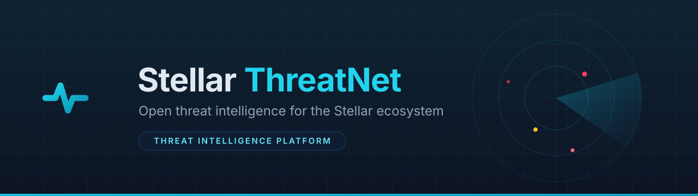

<div align="center">



[](LICENSE)
[](https://github.com/stellar-threatnet/stellar-threatnet/actions)
[](https://github.com/stellar-threatnet/stellar-threatnet/actions)
[](backend/tests/)
[](CONTRIBUTING.md)
[](https://github.com/stellar-threatnet/stellar-threatnet/discussions)

# Stellar ThreatNet

> **The Open Threat Intelligence Platform for the Stellar Ecosystem.**

</div>

Stellar ThreatNet is the first open-source threat intelligence infrastructure
dedicated to the Stellar blockchain ecosystem. It collects, validates, scores,
and distributes threat intelligence on **malicious wallet addresses, phishing
domains, scam tokens, and security incidents** — the shared security layer that
wallets, exchanges, dApps, explorers, organizations, developers, and security
researchers can all integrate with.

ThreatNet is **NOT** a wallet, **NOT** a blockchain explorer, and **NOT** an
antivirus. It is the security infrastructure underneath them.

---

## Table of Contents

- [Core Features](#-core-features)
- [Architecture](#-architecture)
- [Repository Layout](#-repository-layout)
- [Quick Start](#-quick-start)
- [API Overview](#-api-overview)
- [Reputation Scoring Model](#-reputation-scoring-model)
- [Soroban On-Chain Contract](#-soroban-on-chain-contract)
- [Browser Extension](#-browser-extension)
- [Testing](#-testing)
- [Documentation](#-documentation)
- [Contributing](#-contributing)
- [Community](#-community)
- [Maintainers](#-maintainers)
- [Contributors](#-contributors)
- [Security & Responsible Disclosure](#-security--responsible-disclosure)
- [License](#-license)

---

## 🌟 Core Features

| Module | What it does |
| --- | --- |
| **Wallet Reputation Engine** | Real-time scores (0–100) and categories (confirmed malicious / suspicious / under investigation / trusted) for Stellar `G...` public keys, with an explainable evidence trail for every score. |
| **Domain Reputation System** | Detects phishing sites — fake wallets, fake exchanges, fake airdrops, fake token sales — with confidence scores. |
| **Token Reputation Index** | Tracks Stellar assets (`CODE:ISSUER`): impersonation tokens, scam/rugpull tokens, abandoned tokens, verified projects. |
| **Incident Intelligence Database** | Structured incidents (attacks, scams, phishing campaigns, wallet compromises, Soroban contract vulnerabilities) with status, severity, mitigations, and references. |
| **Threat Feed API** | Versioned REST API with OpenAPI v3 docs, pagination, filtering, rate limiting, and a downloadable CSV threat feed. |
| **Community Reporting & Moderation** | Authenticated users submit reports; moderators approve/reject via a moderation queue with per-user voting and full audit logging. Approved reports attach evidence and **recompute reputation scores**. |
| **AI Threat Assistant** | Answers "Is this wallet suspicious?", "Explain this phishing campaign", "Summarize today's threats" — always evidence-based, never overconfident. |
| **Soroban On-Chain Registry** | Rust smart contract storing SHA-256 hashes of confirmed indicators on the Stellar ledger for zero-trust verification. |
| **Browser Extension** | Manifest V3 extension that warns users before visiting known Stellar phishing domains. |
| **CLI & SDKs** | Official Python SDK, TypeScript SDK, and a `threatnet` CLI for terminal workflows. |

---

## 🚀 Architecture

```
                          ┌───────────────────────────┐
                          │   Community & Analysts    │
                          └─────────────┬─────────────┘
                                        │
                                        ▼
┌───────────────────┐     ┌───────────────────────────┐     ┌───────────────────┐
│ Browser Extension │ ──► │  Next.js 14 Dashboard /   │ ──► │ CLI & SDKs        │
│ (Manifest V3)     │     │  Frontend (Tailwind CSS)  │     │ (Python / JS)     │
└───────────────────┘     └─────────────┬─────────────┘     └───────────────────┘
                                        │
                                        ▼
                          ┌───────────────────────────┐
                          │     FastAPI Backend       │
                          │ (JWT + API keys, RBAC)    │
                          └─────────────┬─────────────┘
                                        │
             ┌──────────────────────────┼──────────────────────────┐
             ▼                          ▼                          ▼
  ┌───────────────────┐      ┌────────────────────┐      ┌───────────────────┐
  │ PostgreSQL 15     │      │ Redis 7 / Celery   │      │ Soroban Contract  │
  │ (SQLAlchemy 2.0)  │      │ (Cache & Workers)  │      │ (Stellar Ledger)  │
  └───────────────────┘      └────────────────────┘      └───────────────────┘
```

**Components**

- **FastAPI backend** (`backend/`) — async Python 3.11+; JWT authentication plus
  `X-API-Key` support, role-based access control (`admin`, `analyst`,
  `moderator`, `reporter`, `read_only`), slowapi rate limiting, Redis lookup
  caching with graceful fallback to PostgreSQL, and append-only audit logs.
- **PostgreSQL** — normalized relational store: users, wallets, domains,
  tokens, incidents, community reports, evidence, votes, API keys, audit logs.
- **Redis + Celery** — 15-minute lookup cache and background workers (score
  recalculation, Horizon polling hooks).
- **Soroban contract** (`contracts/`) — on-chain registry of indicator hashes
  for clients that want to verify without trusting the API.

---

## 📁 Repository Layout

```
backend/                 FastAPI service (Python 3.11+, async SQLAlchemy, Celery, Redis)
  app/api/v1/            REST endpoints (auth, lookups, incidents, reports, stats, AI)
  app/services/          threat engine, reputation scoring, caching, Celery tasks
  tests/                 pytest suite (45 tests, in-memory SQLite)
contracts/soroban_threatnet/   Soroban on-chain threat hash registry (Rust, SDK 27)
frontend/                Next.js 14 dashboard (TypeScript, Tailwind)
cli/                     threatnet CLI (lookup, submit, feed, stats, ai)
sdks/python/             Official Python SDK
sdks/javascript/         Official TypeScript SDK
browser-extension/       Manifest V3 phishing warning extension
docs/                    architecture, threat model, API, deployment, governance
.github/                 CI, CodeQL, Dependabot, issue/PR templates
```

---

## 📋 Quick Start

### Prerequisites

| Tool | Version | Used for |
| --- | --- | --- |
| Python | 3.11+ | Backend |
| Node.js | 18+ | Frontend, JS SDK |
| Docker & Docker Compose | — | Full-stack dev environment |
| Rust + Cargo | stable (2024+) | Soroban contract |

### Option A — Full stack with Docker Compose

```bash
git clone https://github.com/stellar-threatnet/stellar-threatnet.git
cd stellar-threatnet
cp .env.example .env          # then set a real SECRET_KEY
docker compose up -d --build
```

| Service | URL |
| --- | --- |
| FastAPI + Swagger UI | http://localhost:8000/docs |
| Next.js dashboard | http://localhost:3000 |
| PostgreSQL | `localhost:5432` |
| Redis | `localhost:6379` |

### Option B — Backend without Docker (fastest for API work)

```bash
cd backend
python3 -m venv .venv && source .venv/bin/activate
pip install -r requirements.txt

# Zero-config dev mode: uses SQLite + in-memory rate limiting (no Redis needed)
DATABASE_URL=sqlite+aiosqlite:///./dev.db CACHE_ENABLED=false uvicorn app.main:app --reload
```

> For a PostgreSQL + Redis setup, use `docker compose up -d postgres redis`,
> then run uvicorn with the default `DATABASE_URL` from `.env`.

### Seed the database (SOC demo data)

The dashboard comes alive with realistic threat intelligence — real publicly
documented Stellar phishing domains, campaigns, reports, and demo users:

```bash
cd backend
# SQLite dev DB (or run without DATABASE_URL against your compose PostgreSQL)
DATABASE_URL=sqlite+aiosqlite:///./dev.db python -m scripts.seed
# wipe + reseed (dev only; refuses to run with ENV=production)
DATABASE_URL=sqlite+aiosqlite:///./dev.db python -m scripts.seed --reset
```

Demo users are created with password `threatnet-demo` (e.g.
`admin@stellar-threatnet.org`, `reporter@stellar-threatnet.org`). See
`backend/scripts/seed.py` for provenance notes.

### Frontend

```bash
cd frontend
npm install
npm run dev                     # http://localhost:3000
# point the dashboard at your backend:
# NEXT_PUBLIC_API_URL=http://localhost:8000/api/v1
```

### CLI

```bash
cd cli
pip install -e .

threatnet lookup wallet GABC...1234
threatnet lookup domain stellar-fake-airdrop.com
threatnet lookup token USDC GBC...ISSUER
threatnet stats
threatnet incidents --status investigating
threatnet submit domain evil-claim.net --description "harvests seed keys" --token tn_...
threatnet feed --output feed.csv
threatnet ai "What is the current phishing campaign?"
```

### SDKs

**Python**

```python
from stellar_threatnet_sdk import ThreatNetClient

async with ThreatNetClient(api_key="tn_...") as client:
    wallet = await client.lookup_wallet("GABC...1234")
    print(wallet["status"], wallet["reputation_score"])
```

**TypeScript**

```ts
import { ThreatNetClient } from "@stellar-threatnet/sdk";

const client = new ThreatNetClient({ apiKey: "tn_..." });
const stats = await client.stats();
console.log(stats);
```

---

## 📡 API Overview

Base URL: `http://localhost:8000/api/v1` · Interactive docs: `/docs`

| Method | Endpoint | Auth | Description |
| --- | --- | --- | --- |
| GET | `/lookup/wallet/{address}` | public | Wallet reputation (0–100 + category) |
| GET | `/lookup/domain/{domain}` | public | Phishing/impersonation confidence |
| GET | `/lookup/token/{code}/{issuer}` | public | Token reputation by `CODE:ISSUER` |
| GET | `/incidents` | public | Paginated incident timeline (+ `status`, `severity` filters) |
| POST | `/incidents` | analyst+ | Publish a security incident |
| GET | `/threats/latest` | public | Recently updated non-trusted entities |
| GET | `/feed` | public | Full CSV threat feed |
| GET | `/stats` | public | Global dashboard metrics |
| GET | `/search?q=` | public | Search wallets, domains, tokens, incidents |
| POST | `/reports` | auth | Submit a community threat report |
| POST | `/reports/{id}/vote` | auth | Up/down-vote a pending report (one per user) |
| POST | `/reports/{id}/moderate` | moderator+ | Approve (attaches evidence) or reject |
| POST | `/ai/query` | public | Ask the AI threat assistant |
| POST | `/auth/register` · `/auth/token` | public | Account creation and login |
| POST | `/api-keys` | auth | Create an API key (shown once) |
| GET | `/admin/audit-logs` | admin | Append-only audit trail |

**Auth**: `Authorization: Bearer <jwt>` for interactive clients, or
`X-API-Key: tn_...` for programmatic access. Authentication endpoints are rate
limited (register 5/min, login 10/min) to resist brute force.

A `404` on any lookup means **no data** — treat unknown entities as neutral,
never as trusted. See [docs/API.md](docs/API.md) for the full reference.

---

## 🧮 Reputation Scoring Model

Scores run 0–100:

| Range | Status | Recommendation |
| --- | --- | --- |
| 0–20 | confirmed malicious | **Block** |
| 21–50 | suspicious | **Warn** |
| 51–79 | under investigation | Info |
| 80–100 | trusted | Allow |

The score is computed from attached evidence:

```
S(E) = 80 − Σ(Wᵢ × Cᵢ) + 20(verified)        (clamped to [0, 100])
```

where `Wᵢ` is the weight of evidence type `i` (on-chain proof 50, payload
sample 40, tx hash 30, screenshot 25, multi-source 20) and `Cᵢ` is its
confidence (0.3 community → 1.0 on-chain proof). Full details in
[docs/THREAT_MODEL.md](docs/THREAT_MODEL.md).

---

## ⛓️ Soroban On-Chain Contract

`contracts/soroban_threatnet/` is a Soroban (Rust, SDK 27) contract storing
**SHA-256 hashes** of confirmed indicators on the Stellar ledger:

- `initialize(admin)` — set the admin (once).
- `publish_threat_indicator(admin, hash, level, score)` — admin-only insert/update.
- `get_threat_indicator(hash)` — zero-trust on-chain verification.
- `get_total_indicators()` — registry size.

Only hashes are stored — the ledger never leaks raw addresses or domains.
See [contracts/soroban_threatnet/README.md](contracts/soroban_threatnet/README.md).

---

## 🧩 Browser Extension

The Manifest V3 extension (`browser-extension/`) checks the current hostname
against the ThreatNet API, caches results for 15 minutes, and shows a blocking
banner on confirmed phishing domains or a warning on suspicious ones.

Install in dev: open `chrome://extensions`, enable **Developer mode**, click
**Load unpacked**, and select `browser-extension/`. See
[browser-extension/README.md](browser-extension/README.md).

---

## ✅ Testing

```bash
# Backend (45 tests: auth, RBAC, lookups, moderation, scoring, stats, SOC, feed)
cd backend && .venv/bin/python -m pytest -q

# Frontend
cd frontend && npm run lint && npm run build

# Soroban contract (unit tests + release wasm build)
cd contracts/soroban_threatnet
cargo test
rustup target add wasm32v1-none && cargo build --target wasm32v1-none --release

# JavaScript SDK
cd sdks/javascript && npx tsc --noEmit
```

Common tasks are also available via the root `Makefile` (`make test`,
`make lint`, `make contract`, `make dev`, ...).

---

## 📚 Documentation

- [Architecture & System Design](docs/ARCHITECTURE.md)
- [Git Workflow Rules](docs/GIT_WORKFLOW.md)
- [Threat Intelligence Data Model](docs/THREAT_MODEL.md)
- [REST API Reference](docs/API.md)
- [Deployment Guide](docs/DEPLOYMENT.md)
- [Developer Guide](docs/DEVELOPER_GUIDE.md)
- [Governance Model](docs/GOVERNANCE.md)
- [Project Roadmap](ROADMAP.md)
- [Good First Issues](GOOD_FIRST_ISSUES.md)

---

## 🤝 Contributing

We welcome contributors — security researchers, Rust/Python/TypeScript
engineers, and docs writers. Please read the [Contributing Guide](CONTRIBUTING.md)
and [Code of Conduct](CODE_OF_CONDUCT.md) first, then grab an issue from
[GOOD_FIRST_ISSUES.md](GOOD_FIRST_ISSUES.md).

CI must pass on every pull request (backend tests, frontend build, contract
tests, CodeQL). Security-relevant changes (auth, scoring, moderation, the
contract) require two maintainer reviews.

---

## 💬 Community

- **GitHub Discussions** — feature ideas, governance proposals, and ecosystem
  questions: <https://github.com/stellar-threatnet/stellar-threatnet/discussions>
- **GitHub Issues** — bug reports and concrete feature requests:
  <https://github.com/stellar-threatnet/stellar-threatnet/issues>
- **Security disclosures** — `security@stellar-threatnet.org` (never a public
  issue; see [SECURITY.md](SECURITY.md)).

---

## 🧑‍💻 Maintainers

| Role | Name | GitHub | Contact |
| --- | --- | --- | --- |
| Lead Maintainer | smog123 | [@smog123](https://github.com/smog123) | adejumooluwasegun35@gmail.com |
| Security Contact | Stellar ThreatNet | — | security@stellar-threatnet.org |

---

## 👥 Contributors

Thanks to everyone who helps secure the Stellar ecosystem — from one-line docs
fixes to new detection rules:

<a href="https://github.com/stellar-threatnet/stellar-threatnet/graphs/contributors">
  
</a>

Want to be on this list? Read [CONTRIBUTING.md](CONTRIBUTING.md) and pick an
issue from [GOOD_FIRST_ISSUES.md](GOOD_FIRST_ISSUES.md).

---

## 🛡️ Security & Responsible Disclosure

ThreatNet is security infrastructure — report vulnerabilities to
**security@stellar-threatnet.org** (never a public issue). We operate a 90-day
coordinated disclosure policy. See [SECURITY.md](SECURITY.md).

Operational notes:

- Passwords are bcrypt-hashed; JWTs are signed with `SECRET_KEY`; API keys are
  stored as SHA-256 hashes.
- The API refuses to start with the default `SECRET_KEY` when
  `ENV=production`.
- Every score change and moderation decision is appended to the audit log.

---

## 📄 License

Stellar ThreatNet is open-source software licensed under the
[MIT License](LICENSE).
